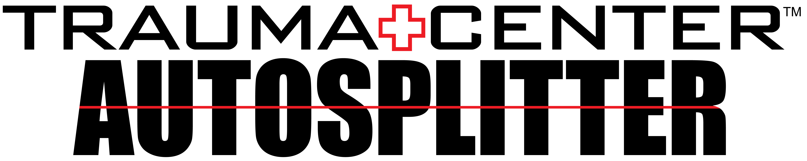

# Introduction

This page provides links + information on the Trauma Center AutoSplitters. These have been created by me, with the intent to make my splits more consistent and to allow me to focus more on the game than readjusting to split every few minutes.

## What is an AutoSplitter?

Without getting too technical, an AutoSplitter looks for conditions to split for you. Some games, such as Portal can look directly at the game's memory to do this, such as looking for a level change. As Trauma Center runs are on console, no such option is available, however instead I am using [Toufool's Auto-Split](https://github.com/Toufool/AutoSplit) that was then forked and developed further by [Avasam](https://github.com/Avasam/AutoSplit/). This software visually compares your game capture with set images I have created, to split for you.

## Disclaimer

While as much effort has been made to make these files as user friendly as possible, you may find that these do not work flawlessly, and as such experimentation may be necessary to get this to work for you and your system. This is due to the image-based comparison methods.

## Files

[AutoSplit 2.0](https://github.com/Avasam/AutoSplit/releases)

[Second Opinion - English](./files/SO-EN.zip){:download; style="text-align: centre;"}
[Second Opinion - Japanese](./files/SO-JP.zip){:download; style="text-align: centre;"}}

[New Blood - English](./files/NB-EN.zip){:download; style="text-align: centre;"}}
[New Blood - Japanese](./files/NB-JP.zip){:download; style="text-align: centre;"}}

[Trauma Team](./files/TT.zip){:download; style="text-align: centre;"}}

# Setup

Regardless of which set of images you are using, the setup will be the same regardless.

1. Ensure you have a copy of AutoSplit 2.0 or newer (link above).
2. Within a folder, place the image folder, the AutoSplit.exe file, and the *'.toml'* file for your relevant game. You can have multiple files and folders collectively here in the event you run multiple games.
3. Move the AutoSplitIntegration.dll into your LiveSplit components folder (often found at C:\Program Files (x86)\LiveSplit\Components).
4. Start OBS, or your recording/streaming software of choice, and start LiveSplit.
5. Open the Layout Editor in LiveSplit (right click > Edit Layout), and click the plus on the right, hover over Control, and click "AutoSplit Integration".
6. Double Click the AutoSplit Integration entry in the list, and then click the Browse button for the AutoSplit Path. Navigate to the folder you created earlier and select the AutoSplit.exe
7. Next, click the Browse button for the Setting Path, and select the *'.toml'* file in question. Click OK once you are done.
8. With AutoSplit open, first click Browse at the top to select the Split Image Folder, and navigate to the folder that matches your *'.toml'* file. 
9. To configure the capture area, click "Select Window" and click OBS (or your chosen software). Ensure this correclty appears in the Capture Region. If it does not, you may need to change the Capture Method found in the Settings.
10. Click "Select Region" and select your game capture as close as possible. This should not include features such as your timer or any chat on screen. If these cover your game, you may not be able to use the autosplitter.
11. Finally, adjust the X, Y / Width, Height values to hone in this capture. You can use the Windows Magnifier to make this easier.

## Video Tutorial

If you don't like reading instructions one by one, then here's a handy video I created:

<iframe width="507" height="287" src="https://www.youtube.com/embed/hH365FfNHvU" title="Trauma Center AutoSplitter Setup" frameborder="0" allow="autoplay" allowfullscreen></iframe>

# FAQ

Q - My live similarity is never reaching the threshold.  
A - This can either be because the threshold is too high, or more likely the capture region isn't fully aligned with the image. Even if you tweak the X, Y / Width, Height values, it may not 100% match the image database. As such, you will need to further adjust these values to get consistent results.

Q - Why is there a yellow border around OBS?  
A - Sadly this is due to the UWP Capture API. It's a "Security Feature" by Microsoft. You cannot remove this I'm afraid.

Q - I need help!  
A - Join the [Trauma Center Discord]https://discord.com/invite/h4qwmkY), and ask for help there. I'll take a look with you to iron out your issues. 

# Special Thanks

Huge thanks to Toufool & Avasam who created the AutoSplit software.
Additionally to Cosimo for testing this in the projects infancy, and gave me ideas to streamline this.
